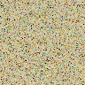
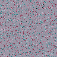

# Voxel Slime

Physarum に着想を得た 3D 生成アートです。複数種のエージェントがボクセル空間でトレイルを残し、種間相互作用しながら有機的なネットワーク構造を成長させます。

## 生成サンプル（GIF）

GitHub の README 上でそのまま再生表示されます。

| fungi | coral | nebula |
| --- | --- | --- |
|  |  |  |

## クイックスタート

```bash
python -m venv .venv
source .venv/bin/activate
pip install -r requirements.txt
```

まずは見栄えのよい標準シミュレーション（`fungi` プリセット、2,000 ステップ）:

```bash
python run.py --preset fungi --seed 7 --out outputs/fungi
```

最大値投影フレームから GIF を作成:

```bash
python scripts/make_gif.py \
  --frames-dir outputs/fungi/frames/mip \
  --pattern "mip_*.png" \
  --out outputs/fungi/fungi_mip.gif \
  --fps 24
```

トレイル場（全種チャネル合成）の等値面から OBJ メッシュを書き出し:

```bash
python run.py --preset coral --steps 1200 --seed 42 --export-obj --obj-threshold 12 --out outputs/coral_obj
```

## CLI オプション

```bash
python run.py \
  --preset {fungi,nebula,coral} \
  --size 96 \
  --agents 50000 \
  --steps 2000 \
  --seed 42 \
  --species 3 \
  --interaction-mode {symmetric,cyclic} \
  --self-attract 1.0 \
  --cross-attract -0.35 \
  --out outputs/run_name \
  --save-every 10 \
  --render-colormap magma \
  --render-gamma 0.9 \
  --export-obj \
  --obj-threshold 9.5 \
  --boundary {wrap,reflect} \
  --slice-axis {x,y,z} \
  --slice-index 48
```

## アルゴリズム（5ステップ）

1. 3D ボクセルグリッド内に、多数のエージェントをランダムな位置・向き・種別で初期化します。
2. 各エージェントは進行方向の周辺（前方、左右、上下、対角）で、全種トレイル濃度をセンシングします。
3. 種間相互作用行列に基づいてスコア化し、より有利な方向へ旋回して 1 ボクセル移動します。
4. 各エージェントは自分の種チャネルにトレイルを堆積し、毎ステップ拡散（近傍平均）と蒸発を適用します。
5. 中央スライスと最大値投影をカラー PNG で保存し、必要に応じて全チャネル合成場から marching cubes で 3D メッシュを抽出します。

## 出力

- `outputs/<run>/frames/slice/slice_XXXXXX.png`: 軸方向スライス画像（カラー、自動コントラスト調整）。
- `outputs/<run>/frames/mip/mip_XXXXXX.png`: 最大値投影画像（カラー、自動コントラスト調整）。
- `outputs/<run>/mesh.obj`（任意）: 頂点法線付きの marching cubes メッシュ。

## プリセット

- `fungi`: 3種・循環相互作用 + 中程度の拡散 + 低蒸発 -> 菌糸状で絡み合うネットワーク。
- `nebula`: 4種・相互引力 + 強い拡散 + 高蒸発 -> 雲のような重なり表現。
- `coral`: 2種・相互反発 + 低めの拡散 + 強い堆積 -> 太く分岐するサンゴ状構造。

## 補足

- `--seed` を指定すると再現可能な（決定論的な）実行になります。
- Physarum の particle/trail モデルと、走化性に類似した振る舞いに着想を得ています。
- 試行を高速化したい場合は `--steps`、`--agents`、`--size` を下げてください。
- 見た目を変えるには `--species`、`--interaction-mode`、`--cross-attract`、`--render-gamma` の調整が効きます。

## リポジトリ構成

```text
voxel-slime/
  run.py
  src/
    __init__.py
    config.py
    agents.py
    trail.py
    simulate.py
    render.py
    export.py
    utils.py
  configs/
    fungi.yaml
    nebula.yaml
    coral.yaml
  scripts/
    make_gif.py
  requirements.txt
  README.md
  LICENSE
```
